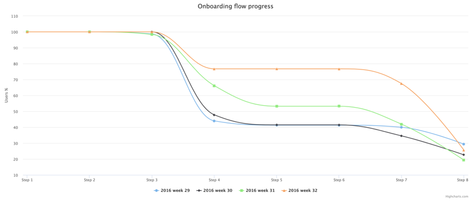

# nda project =)

Screenshot 2019-10-20 23.51.01

## HowTos

### Run

`docker-compose up`

Wait a bit for composer install to be complete and open http://docker-machine

### Test

```
docker-compose up composer
docker-compose -f docker-compose.yml -f docker-compose.test.yml up phpunit
```

## Assumptions/Questions

* There are sometimes unknown (probably legacy) percentages in csv, 
  I made extra map to convert them to steps
* Sometimes percentage is missing in csv file, I log such a cases and ignore them
* Maybe getters per each step in `StepPercentagesPerWeek` are too much,
  but I always prefer explicit methods&variables over magic arrays 
* There are some performance considerations describen in comment of `aggregatePercentages` 
  method
* npm&vue setup turned out to be too much for me to fit in 4 hours
